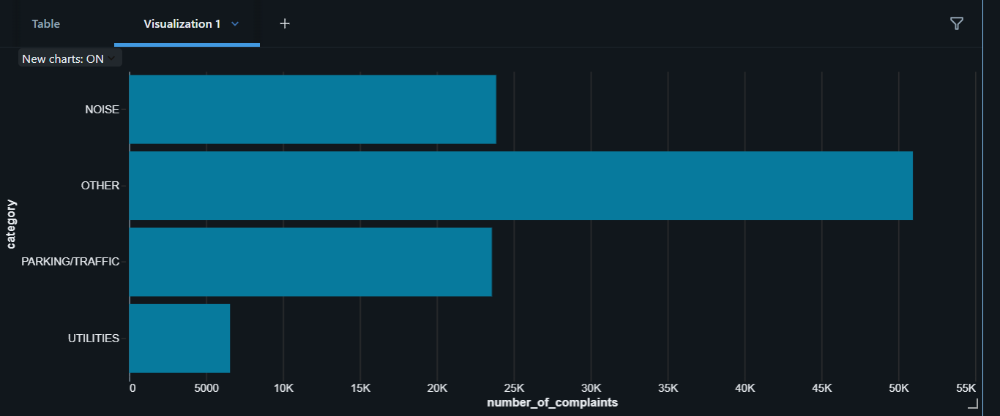

# databricks-nyc-311-pipeline
ETL pipeline for analyzing NYC 311 complaints using Databricks and Apache Spark.

# Cloud Analytics Pipeline: NYC 311 Complaints Analysis

### **Project Overview**

This project demonstrates a complete, end-to-end ETL (Extract, Transform, Load) pipeline built in Databricks to process, clean, and analyze over 100,000 service complaints from NYC's 311 system. The goal was to use big data tools to uncover patterns in city-wide complaints and build a scalable data processing workflow.

---

### **🛠️ Tech Stack**

* **Cloud Platform:** Databricks Community Edition
* **Core Engine:** Apache Spark
* **Language:** Python (PySpark), SQL
* **Key Libraries:** Spark SQL, UDFs (User-Defined Functions)

---

### **🚀 The ETL Pipeline Explained**

The pipeline follows a standard, multi-stage process to turn raw, messy data into clean, query-able insights.

1.  **Extract:** Raw CSV data containing 311 service requests was loaded from the Databricks FileStore (DBFS) into a Spark DataFrame.
2.  **Transform:**
    * **Cleaning:** Selected relevant columns, converted date strings to proper timestamp formats, and removed rows with null values.
    * **Enrichment:** Developed a Python UDF to categorize diverse complaint types into broader, more useful groups (e.g., 'Noise - Residential' -> 'NOISE').
    * **Feature Engineering:** Extracted month and year from the timestamp to enable trend analysis.
3.  **Load:** The transformed, clean data was registered as a temporary SQL view in Spark, making it immediately available for high-performance querying and analysis.

---

### **📊 Results & Visualizations**

The analysis revealed key trends in the 311 complaint data.

#### **Most Common Complaint Categories**

The primary driver of 311 calls is noise, followed closely by parking and traffic-related issues.

<!-- Add your "Complaint Category" chart screenshot here! -->

#### **Complaints by Borough**

Brooklyn and Queens emerged as the boroughs with the highest volume of 311 complaints.

<!-- Add your "Complaints by Borough" chart screenshot here! -->

---

### **📂 Repository Contents**

* `databricks_nyc_311_analysis.py`: The clean Python source code for the Databricks notebook.
* `databricks_nyc_311_analysis.html`: A full HTML export of the notebook, including the code and all the visual outputs.
* `/images`: Folder containing the screenshots used in this README.

---

### **✍️ Author**

* **Pratham R**
* **LinkedIn:** [linkedin.com/in/pratham-r-348b60262](https://linkedin.com/in/pratham-r-348b60262)
